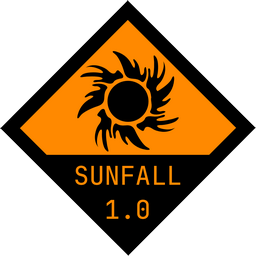

# Sunfall, postapocalyptic modpack for Minecraft 1.7.10

### Based around [GregTech 6](https://github.com/GregTech6/gregtech6) and [HBM's Nuclear Tech Mod](https://github.com/HbmMods/Hbm-s-Nuclear-Tech-GIT)

Not sure when it will be done or if it will be done at all.

Expect a lot of random Russian comments and NSFW language

More info at [Discord](https://discord.gg/BxQJcpxZHY) (warning, even more Russian and NSFW)

## Credits

[GTNewHorizons Team](https://github.com/GTNewHorizons) for keeping 1.7.10 alive in 2024

[JetBrains](https://www.jetbrains.com/) for JetBrains Mono font

[GMG](https://forum.mechaenetia.com/u/GMG) for GT6 textures

[AmpageR](https://www.reddit.com/u/AmpageR/) for 1.14 textures backport to 1.7

[Reimagined GUI Dark](https://modrinth.com/resourcepack/reimaginedguidark) for new GUI
